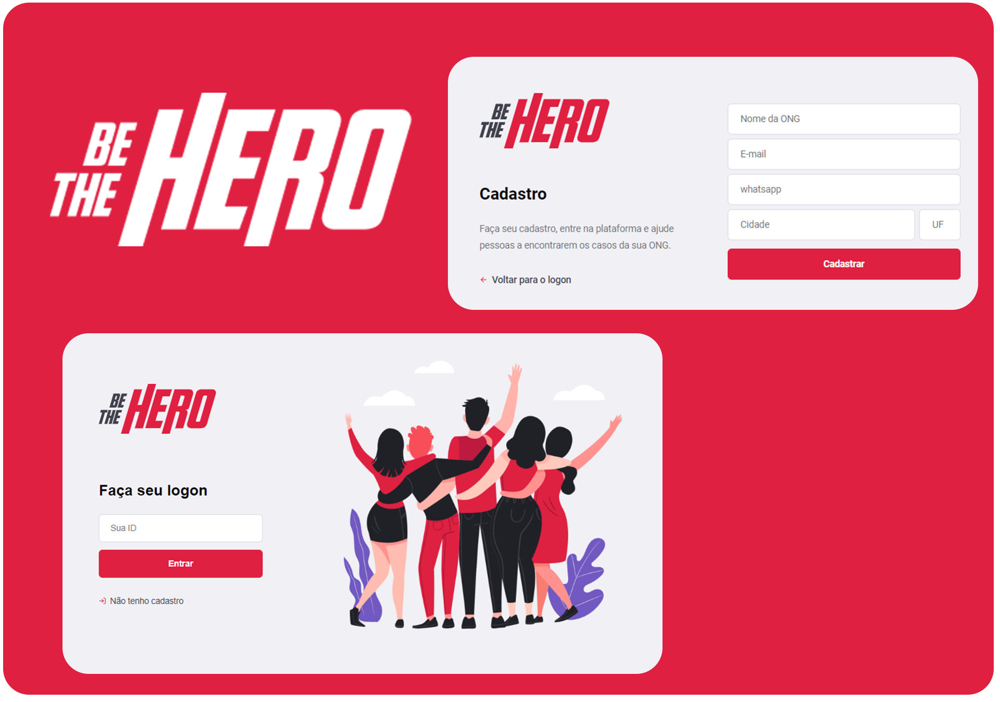

<h2 align="center">
     
    <h3 align="center">Uma aplicação para conectar sua ONG com pessoas que queiram ajudar</h3>
</h2>

---

Projeto desenvolvido durante a semana Omnistack 11 da <a href="https://rocketseat.com.br">Rocketseat</a> 🚀

 

  

    

  
  
  

Commit and License

  
  

Seja um Herói

  </img> 

Guia de Navegação

  <a href="#projeto-%EF%B8%8F">Tecnologias</a>&nbsp;&nbsp;&nbsp;|&nbsp;&nbsp;&nbsp;
  <a href="#como-contribuir">Como contribuir</a>&nbsp;&nbsp;&nbsp;|&nbsp;&nbsp;&nbsp;
  <a href="#licen%C3%A7a-memo">Licença</a>

##  Projeto 🦸‍♀️
O Be The Hero foi um projecto construido na Semana Omnistack 11 da Rocketseat, um treinamento intensivo nas tecnologias NodeJs, React e React-Native e em todo o ecosistema poor volta destas tecnologias.

## Tecnologias 🚀

Esta aplicação foi desenolvida com as tecnologias abaixo:
- [x] [Node.js](https://nodejs.org/en/)
- [x] [ReactJS](https://reactjs.org/)
- [x] [React Native](https://reactnative.dev/)
- [x] [Expo](https://expo.io/)
- [x] [Express](https://expressjs.com/pt-br/)
- [x] [Celebrate](https://github.com/arb/celebrate)
- [x] [SQLite](https://www.sqlite.org/)
- [x] [React Router DOM](https://reacttraining.com/react-router/)
- [x] [React Navigation](https://reactnavigation.org/)
- [x] [React Icons](https://react-icons.netlify.com/#/)
- [x] [Styled Components](https://styled-components.com/)
- [x] [Axios](https://github.com/axios/axios)

## Como contribuir

Se quiser contribuir para esse repositório aqui, seja corrigindo algum problema, adicionando comentários ou melhorando a documentação, você pode seguir esse tutorial abaixo:

- Faça [um fork](https://help.github.com/pt/github/getting-started-with-github/fork-a-repo) desse repositório;
- Entre no seu perfil no GitHub e faça um clone do repositório que você fez um fork;
- Cria uma branch com a sua alteração: `git checkout -b minha-alteracao`;
- Faça as alterações necessárias no código ou documentação;
- Faça commit das suas alterações: `git commit -m 'feat: Minha nova feature'`;
- Faça push para a sua branch: `git push origin minha-alteracao`;
- Agora é só abrir a sua Pull Request no repositório que você fez o fork;

Depois que o merge da sua pull request for feito, você pode deletar a sua branch.

##  Licença :memo:

Esse projeto está sob a licença MIT.

---

Feito com ♥ <strong>.</strong> by Edgar de Jesus

